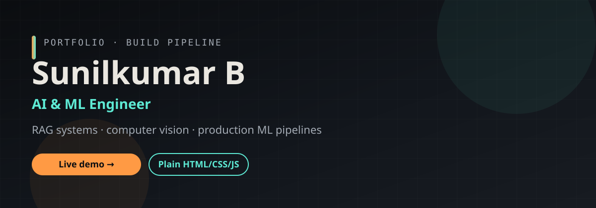

<div align="center">



<br />


# Sunilkumar B
### AI & ML Engineer

I turn research ideas into working systems — RAG pipelines, CNN-based verification, Dockerized services, and the CI/CD that ships them.

[](https://sunilkumarportfolio.vercel.app)
[](resume.pdf)
[](https://github.com/sunil-offx)
[](https://www.linkedin.com/in/sunilkumar-b-2575a3318)

<br />


</div>

---

## About

AI & ML engineer focused on **RAG systems**, **computer vision**, and **production ML pipelines**. Currently building at **IITM Pravartak Technologies** and running **ORBIS**, a small freelancing agency for web + AI/ML work.

During internship work: automated data ingestion (~60% less manual processing), Dockerized services, CI/CD for faster releases, and an IoT telemetry prototype on AWS S3.

---

## Featured projects

<table>
<tr>
<td width="33%" valign="top">

### Voter Identity Verifier
**Individual** · CNN + OCR

Dockerized identity verification with ResNet-50 face matching, document OCR, AWS S3, and CI/CD.

`ResNet-50` `OCR` `Docker` `AWS S3`

</td>
<td width="33%" valign="top">

### Personalized RAG System
**Individual** · Retrieval

Document ingestion → chunking → embeddings → FAISS retrieval → context-aware LLM answers.

`RAG` `FAISS` `Embeddings` `LLM`

</td>
<td width="33%" valign="top">

### Velan Pannai
**Team** · E-commerce

Farm-to-consumer dairy storefront in React — product listings, cart, and checkout.

`React` `E-commerce` `Ongoing`

</td>
</tr>
</table>

---

## Design system

Dark “build pipeline” UI — sections read like CI stages, and a status rail shifts **amber → teal** as you scroll.

| Token | Hex | Role |
| :---: | :---: | --- |
|  | `#0b0d10` | Background |
|  | `#171b21` | Surfaces |
|  | `#eae7e0` | Text |
|  | `#ff9a44` | Amber · running |
|  | `#5eead4` | Teal · verified |

**Type:** Space Grotesk · Inter · IBM Plex Mono  
**Motion:** scroll-reveal + pipeline rail, all gated by `prefers-reduced-motion`

---

## Quick start

```bash
# clone
git clone https://github.com/sunil-offx/sunilkumarportfolio.git
cd sunilkumarportfolio

# serve (keeps PDF / relative links happy)
python3 -m http.server
# → http://localhost:8000
```

Or just open `index.html` in a browser.

<details>
<summary><strong>Repo layout</strong></summary>

```
index.html     full site (structure + styles + behavior)
banner.svg     README hero banner
profile.png    headshot (CSS grayscale on-site)
resume.pdf     linked from hero CTAs
README.md      you are here
```

</details>

<details>
<summary><strong>Customize content</strong></summary>

| What | How |
| --- | --- |
| Copy | Edit text inside each `<section id="...">` in `index.html` |
| Photo | Replace `profile.png` (or update the `` `src` / `alt`) |
| Résumé | Replace `resume.pdf`, or change the hero link `href` |
| Skill bars | Set `data-level` (0–100) on each skill row |
| Contact form | Uses `mailto:` today — point the form at Formspree / Netlify Forms / your API to go live |

</details>

---

## Deploy

Zero build step. Publish the repo root (`.`):

| Host | Notes |
| --- | --- |
| **Vercel** | Live now → [sunilkumarportfolio.vercel.app](https://sunilkumarportfolio.vercel.app) |
| **Netlify** | Drag-and-drop or connect repo; publish `.` |
| **GitHub Pages** | Enable Pages on `main` (root) |

---

## Accessibility

- Semantic landmarks + skip link + `:focus-visible` rings
- WCAG AA contrast on the dark palette
- `prefers-reduced-motion: reduce` turns motion off
- Responsive down to phones (rail hides ~900px; nav collapses ~720px)

---

<div align="center">

### Let's build something

[📧 Email](mailto:sunilkumarsra2@gmail.com) · [💼 LinkedIn](https://www.linkedin.com/in/sunilkumar-b-2575a3318) · [🐙 GitHub](https://github.com/sunil-offx) · [🌐 Live site](https://sunilkumarportfolio.vercel.app)

<br />

<sub>Built with vanilla HTML / CSS / JS — no framework, no build step.</sub>

</div>
